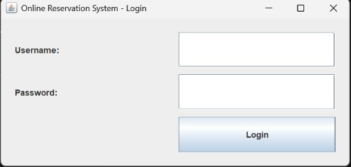
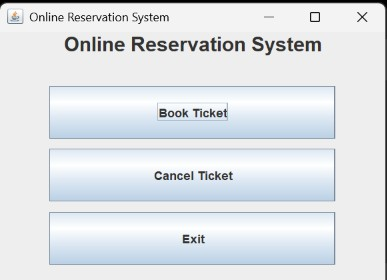
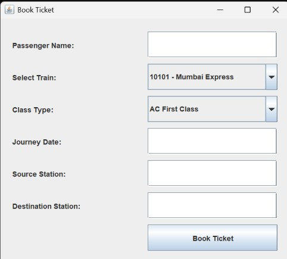
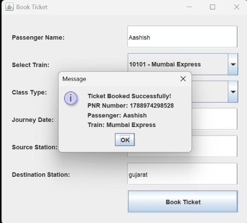
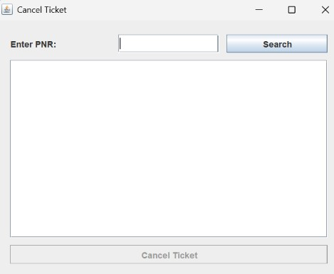
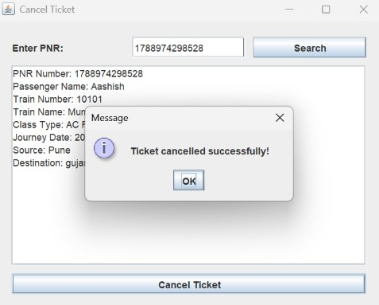

# OIBSIP

## Oasis Infobyte Java Development Internship

### Task 1: Online Reservation System

This project is developed as part of the Oasis Infobyte Java Development Internship.

## Project Description

The Online Reservation System is a Java-based desktop application that allows users to log in, book train tickets, and cancel reservations using a MySQL database.

## Technologies Used

- Java
- Swing
- JDBC
- MySQL
- IntelliJ IDEA
- Maven

## Features

- User login authentication
- Train selection
- Ticket booking
- Automatic PNR generation
- Journey date entry
- Source and destination station details
- Ticket cancellation using PNR
- MySQL database connectivity
- Input validation

## Screenshots

### Login Screen


### Main Menu


### Book Ticket


### Booking Successful


### Cancel Ticket


### Cancellation Successful

Internship

How to Run
Install Java JDK.
Install MySQL.
Create the OnlineReservationSystem database.
Create the required tables.
Update the MySQL username and password in DBConnection.java.
Open the project in IntelliJ IDEA.
Run LoginForm.java.
Login using the provided credentials.


## Database Tables

- `users`
- `trains`
- `reservations`

## Login Credentials

```text
Username: admin
Password: admin123


OnlineReservationSystem/
├── pom.xml
└── src/
    └── main/
        └── java/
            └── org/
                └── example/
                    ├── DBConnection.java
                    ├── LoginForm.java
                    ├── MainMenu.java
                    ├── ReservationForm.java
                    └── CancellationForm.java

This project is completed as part of the Oasis Infobyte Java Development Internship.

#oasisinfobyte
